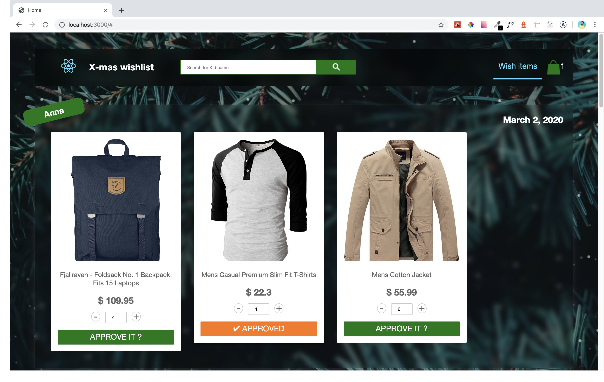

# Imaginary Kids Xmas wishlist application for Parents

Simple imaginary christmas gift picking marketplace where parents can approve kids xmas wish list

This application consist of wish list for 5 kids for the parent, where he/she can view respective products under wish list. Parent can approve the product based on his/her choice, product gets added to cart, if same types of products has been added to cart the discounts gets added, add/remove from cart flow is added amd at last parent can proceed to checkout. Also search by kid's name feature added and cart is made available in menu option.

# Technologies Used:

- Next.js, React, TypeScript, HTML5, Pure CSS.
- Plugins/Libraries:
  - Context API for client-data related state management.
  - React Query library for API call for better caching and server-data related management at client side.
  - APIs:
    - Get all carts with limit 5 [Wish list for kids](https://fakestoreapi.com/carts?limit=5)
    - Get product details belongs to Wish list eg: [Product details by Id:2 ](https://fakestoreapi.com/products/2)
  - CSS Transitions for animation effect.
- Dev Tools:
  - ESLint with strict type-check for writing standard TypeScript code.
  - Prettier for code formating and indentation.
  - Husky and lint-staged for pre commit hook that verifies lint and type-check
  - Unit testing using jest
  - Custom ESLint rules under `.eslintrc.js`
  - Custom TypeScript configurations under `tsconfig.json`
  - API url config under `.env.local`
  - Relative path configuration with alias `@/...` for importing statements

# Features / points covered:

It has been implemented with below aspects,

- Started from scratch using `yarn`.
- Added packages on gradual and need basis, refer to `package.json` for more details.
- Design patterns:
  - Next.js based pattern for creating pages.
  - Atomic design pattern for components.
  - Decorator (HOC) pattern for components.
  - Strategy and Chain of responsibilities pattern for Cart flow etc
- Layout:
  - Layout with header that consist of navigation, main content and footer.
  - Backgorund effect with image and Pure CSS based snow animation effect.
  - Navigation menu with two tabs (menus) for wish list and Cart item. It also contains brand logo, search filter by kid name.
  - For wish list view, tile view for wish list that displays Kid's name at the top along with date and then respective product tiles under respective wish list
  - For cart view, list of added items in cart, respective amount and proceed to checout option
  - Porduct tile with image, title, quantity (counter) option, approve button etc
  - Quick view (modal) for larger product image and details view.
- During application load, fetched cart list with limit 5 as collection of wish list, displayed those as respective collection and then loadded respective product details that belongs to corresponding cart (wish list) item.
- On click of image in product tile, it opens quick view (modal) that displays larger image, along with title and price
- On click of quantity counter, respective increement/decreement of number of items can be done that works only upto min/max actual values.
- On click of approve button, it changes to approved view, the product tile gets removed and cart get updated with respective product.
- During Cart menu option click, card content gets loaded, its shows list of all added products, combined same type products along with number of units, unit price, actual value and discounts.
- Discount rule applied on client side, rule:if 2 same types of product added then discuount 20% and so on upto 9 types with discount 90%. If more than 9 then 0 discount applied.
- Cart amount values based on discount rule, and final amount gets calculated. It also contains proceed to checkout option
- Responsive: Added media query for respective components inside css modules.
- Custom error handling components
- No results and empty cart flow
- Basic flow for search by kid's name to filter wish list

# Folder Structure and Files:

- `src` for all the application code
- `test` for all unit test cases
- `src/pages` for application pages
- `pages/_error.tsx` for custom error handling and message to user
- `pages/_app.tsx` for configuring react-query, context-api providers etc
- `.env.local` for API base url under env variable
- `src/lib` for configurations, types, context, queries(api calls), utils, global styles etc
- components for all the components based on atomic design pattern – templates to organisms to molecules to atoms.

# Pending items:

- Product quantity increement/decreement messages after validation.
- Animation while removing product tile after approval.
- Proper messaging to user during its approve/remove operations.
- Refinements in filter by name and additional filter by product name feature.
- On checkout save cart list (wish list) feature in API.
- Responsive support for tab/mobile across the application.

## How to use

Go to root directory "kids-xmas" and Execute commands with `yarn` or `npm`

## Installing the application

- If node is not installed then Install [node] (https://nodejs.org/en/download/)
- Run the following command to load all the module dependencies for app:

```bash
yarn
```

Or

```bash
npm install
```

## Dev mode

### check typescript related errors

```bash
yarn type-check
```

Or

```bash
npm run type-check
```

It runs typecheck and shows typescript code related errors across the application.

### check lint related errors

```bash
yarn lint .
```

Or

```bash
npm run lint .
```

It runs ESLint and shows lint specific errors across the application

## To run the application on dev mode

```bash
yarn dev
```

Or

```bash
npm run dev
```

It runs the next.js based app in the development mode. Open http://localhost:3000 to view it in the browser. The page will reload if you make edits.

# Screenshots

### Home page - All wish lists

<p align="center">
  
  <br/>
</p>

### Home page - approve product flow

<p align="center">
  
  <br/>
</p>

### Cart view - product lists and total amount

<p align="center">
  
  <br/>
</p>

### Cart view - Remove product hover effect

<p align="center">
  
  <br/>
</p>

### Empty cart view

<p align="center">
  
  <br/>
</p>

### Home page - filter by name

<p align="center">
  
  <br/>
</p>
